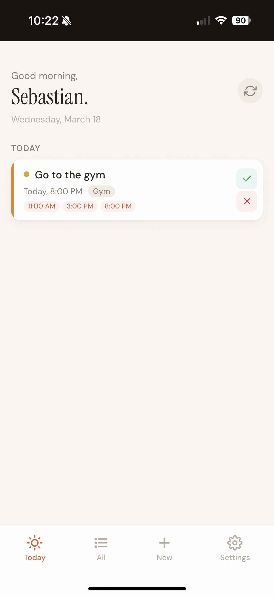
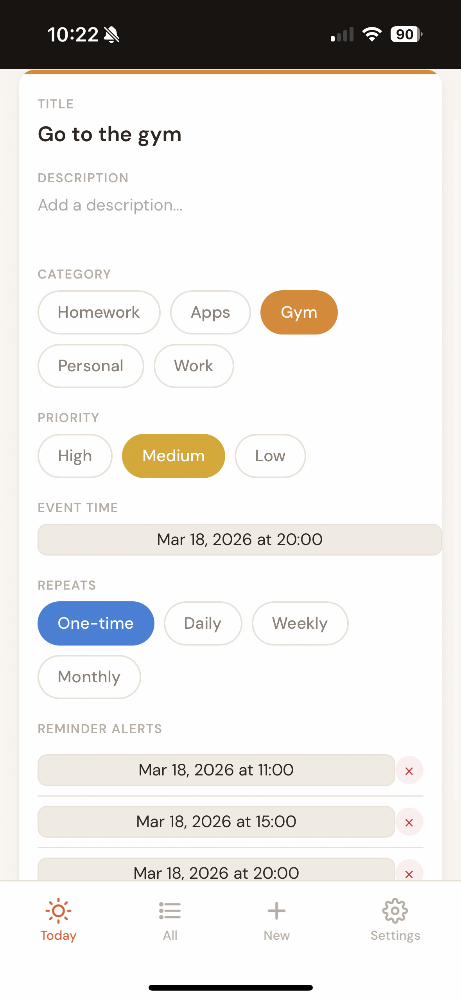

# Reminders

A voice-first, AI-powered reminder app. Speak naturally, and AI handles the rest — categories, priorities, timing, and alert schedules.

Built for personal use. Simple stack, no cloud services, runs on any machine.

## Demo

https://github.com/user-attachments/assets/WholeAppInUse.MP4

## Screenshots

| Today's Reminders | Create with Voice | Reminder Detail |
|---|---|---|
|  |  |  |

## Features

- **Voice-first creation** — tap the mic, speak your reminder, AI parses everything
- **AI-powered parsing** — Gemini 2.5 Flash extracts title, category, priority, event time, and alert schedule from natural speech
- **Multiple reminder alerts** — set multiple notification times per reminder (e.g. "remind me at 6pm and 6:30pm")
- **Recurring reminders** — daily, weekly, monthly with auto-creation of next occurrence
- **Browser notifications** — get notified when alerts are due
- **Multi-user** — simple user ID separation (no auth needed for personal use)
- **Dark mode** — warm paper aesthetic with full dark mode support
- **PWA installable** — add to home screen on mobile

## Stack

- **Backend**: Python (FastAPI + SQLite)
- **Frontend**: Single-file PWA (vanilla JS, no build tools)
- **AI**: Google Gemini 2.5 Flash
- **Voice**: Web Speech API (browser-native)

## Quick Start

### 1. Get a Gemini API Key

Go to [Google AI Studio](https://aistudio.google.com/apikey) and create a free API key.

### 2. Clone and Configure

```bash
git clone https://github.com/SebastianLeonD/reminderapp.git
cd reminderapp/backend
pip3 install -r requirements.txt
cp .env.example .env
```

Edit `.env` and add your Gemini API key:

```
GEMINI_API_KEY=your-actual-key-here
```

### 3. Run

```bash
python3 -m uvicorn main:app --host 0.0.0.0 --port 8000
```

Open [http://localhost:8000](http://localhost:8000) in your browser.

### 4. (Optional) Expose to the Internet

To access from your phone or share with a friend, use [Cloudflare Tunnel](https://developers.cloudflare.com/cloudflare-one/connections/connect-networks/):

```bash
brew install cloudflared
sudo cloudflared service install <your-tunnel-token>
```

Point the tunnel to `http://localhost:8000`.

### 5. (Optional) Run as a System Service (macOS)

To keep the server running after terminal closes and auto-start on boot:

```bash
cat > ~/Library/LaunchAgents/com.reminderapp.server.plist << 'EOF'
<?xml version="1.0" encoding="UTF-8"?>
<!DOCTYPE plist PUBLIC "-//Apple//DTD PLIST 1.0//EN" "http://www.apple.com/DTDs/PropertyList-1.0.dtd">
<plist version="1.0">
<dict>
    <key>Label</key>
    <string>com.reminderapp.server</string>
    <key>ProgramArguments</key>
    <array>
        <string>/usr/local/bin/python3</string>
        <string>-m</string>
        <string>uvicorn</string>
        <string>main:app</string>
        <string>--host</string>
        <string>0.0.0.0</string>
        <string>--port</string>
        <string>8000</string>
    </array>
    <key>WorkingDirectory</key>
    <string>/path/to/reminderapp/backend</string>
    <key>RunAtLoad</key>
    <true/>
    <key>KeepAlive</key>
    <true/>
    <key>EnvironmentVariables</key>
    <dict>
        <key>PATH</key>
        <string>/usr/local/bin:/usr/bin:/bin</string>
    </dict>
</dict>
</plist>
EOF
```

Update the `WorkingDirectory` and Python path (`which python3`) for your system, then:

```bash
launchctl load ~/Library/LaunchAgents/com.reminderapp.server.plist
```

## Usage

### Voice Input

Tap the mic and speak naturally:

- *"Remind me to submit homework by Friday 3pm, really important"*
- *"Gym every Monday at 7am"*
- *"Go to work tomorrow at 3pm, remind me today at 11pm and tomorrow at 8, 9, and 10am"*
- *"Take vitamins daily at 8am"*

AI will parse the title, category, priority, event time, alert schedule, and recurrence.

### Categories

homework, applications, gym, personal, work

### Multi-User

Each user sets a unique User ID in Settings. Reminders are separated by this ID. No passwords — just a name.

## Project Structure

```
reminderapp/
  backend/
    main.py           # FastAPI server + SQLite + Gemini AI
    requirements.txt   # Python dependencies
    .env.example       # Template for API key
    run.sh             # Quick start script
  pwa/
    index.html         # Entire frontend (single file PWA)
    manifest.json      # PWA metadata + icon
    sw.js              # Service worker for offline caching
```

## API Endpoints

| Method | Path | Description |
|--------|------|-------------|
| GET | `/webhook/api/reminders` | List reminders |
| POST | `/webhook/api/reminders` | Create reminder |
| PUT | `/webhook/api/reminders/{id}` | Update reminder |
| DELETE | `/webhook/api/reminders/{id}` | Delete reminder |
| POST | `/webhook/api/reminders/{id}/complete` | Mark complete (auto-creates next for recurring) |
| POST | `/webhook/api/reminders/parse` | AI parse natural language |
| GET | `/webhook/api/due-alerts` | Get due notification alerts |

All endpoints require `x-user-id` header.

## License

MIT
